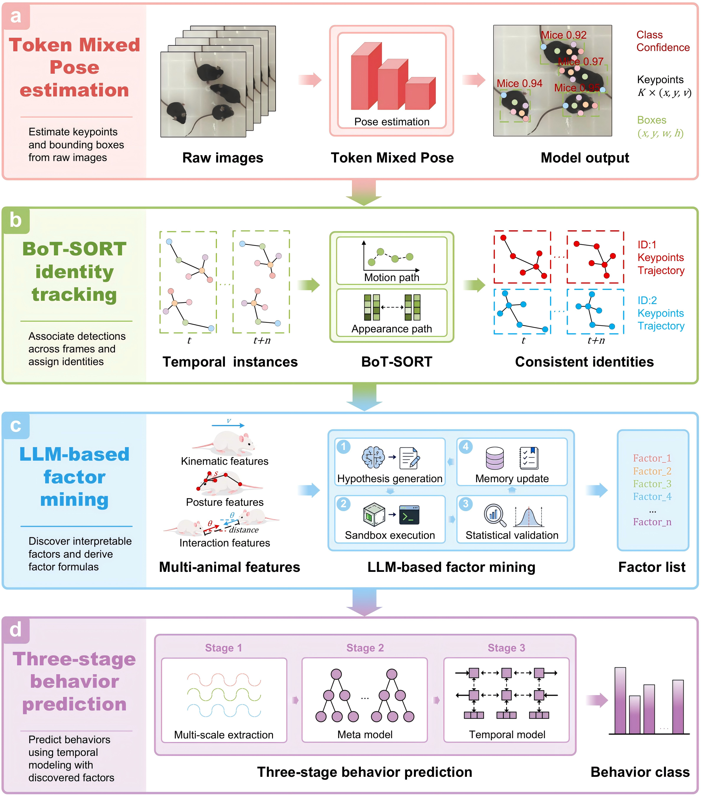
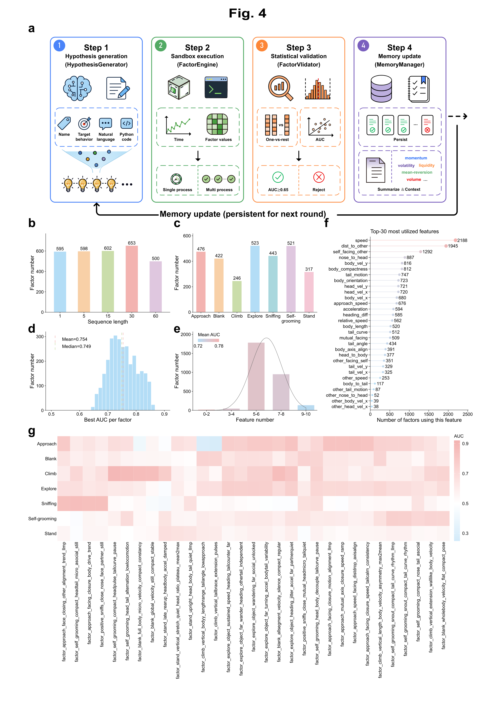
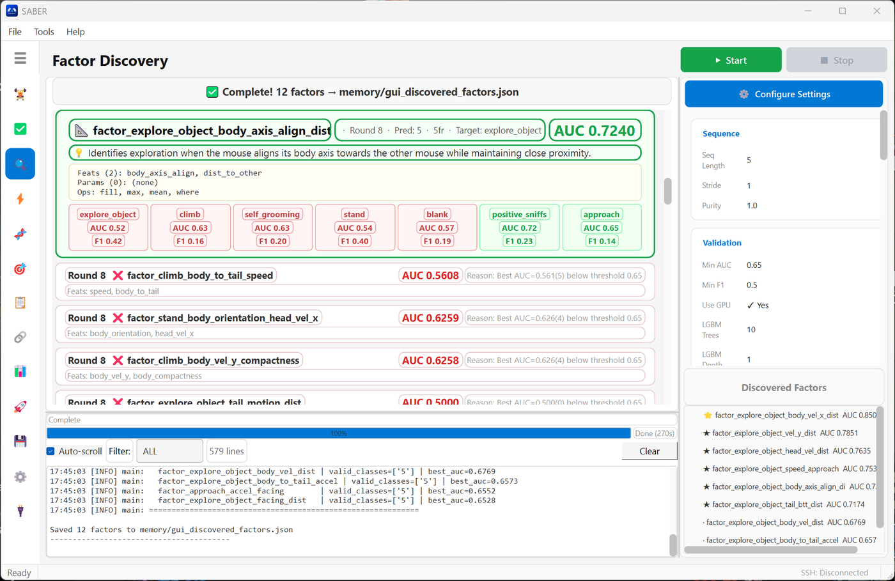
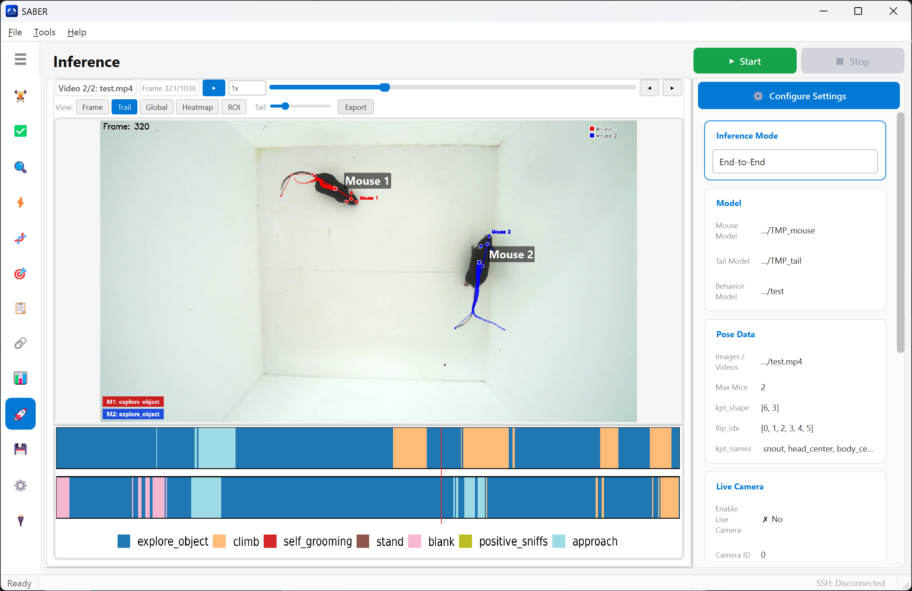

# SABER

**S**patio-temporal **A**ction **BE**havior **R**ecognition — identity-resolved quantification of multi-animal social behavior.

[](https://www.python.org/)
[]()
[](LICENSE)

SABER is a locally deployable, open-source framework that converts a single overhead video stream into identity-resolved behavioral measurements — accessible through a desktop GUI, CLI entry points, and a Python API.

<p align="center">
  
</p>

**Four components, one workflow:**

- **TMP pose estimation** — a single-stage keypoint detector for overlapping, interacting animals (mAP 92.0 ± 1.5 % vs. 60.7–73.7 % for DeepLabCut / SLEAP / AlphaTracker).
- **Identity-preserving tracking** — BoT-SORT + appearance ReID links detections into identity-indexed trajectories, with the lowest ID-switch / target-loss / keypoint-switch errors across mating, aggression and four-mouse paradigms.
- **LLM-based factor mining** — a closed loop proposing executable formulas, evaluating them on 42 kinematic / postural / social variables, and keeping factors passing a one-vs-rest LightGBM gate (AUC ≥ 0.65): 3,128 interpretable factors mined without hand-crafted feature engineering.
- **Three-stage temporal prediction (3-STBP)** — short / medium / long-range group LightGBMs → meta-learner → temporal refinement (BiLSTM or temporal-LightGBM) with calibration and rule correction; accuracy > 70 %, macro AUC ≈ 90 % (vs. ≈ 38 % for A-SOiD, < 25 % for B-SOiD).

## Installation

```bash
pip install -r requirements.txt
```

For LLM-based factor mining, configure an OpenAI-compatible API key:

```bash
cp .env.example .env      # fill in OPENAI_API_KEY
```

Dataset paths, LLM endpoints and mining thresholds live in `config/seq/*.yaml` (one combined config per sequence length); classifier and temporal-model settings live in `config/validation.yaml`. A CUDA GPU is recommended for TMP training and inference; mining and the LightGBM stages run on CPU.

## Data & Model Zoo

The full dataset and all model weights used in the paper are hosted on ScienceDB:

| Resource | Link | Contents |
|----------|------|----------|
| **Full dataset** | [https://www.scidb.cn/s/UrAjMr](https://www.scidb.cn/s/UrAjMr) | Per-video TMP keypoints (mouse body + tail, YOLO pose `.txt`), per-mouse behavior annotations, and the dataset configuration file (`dataset_config.json`) used throughout the paper |
| **Model weights** | [https://www.scidb.cn/s/RjQRFz](https://www.scidb.cn/s/RjQRFz) | TMP pose checkpoints (`TMP_mouse.pt`, `TMP_tail.pt`) and the trained 3-STBP behavior-prediction bundle (`20260626_171940/` with `weights/`, `factors.json`, `configs/merged_config.yaml`) |

## Quick Start

Scripts are grouped by function, mirroring the GUI tabs:

| Script | Function |
|--------|----------|
| `training/train_behavior.py` | Train the 3-stage behavior prediction model |
| `training/pose_train.py` | Train the TMP pose model (YOLO + TMP backbone) |
| `mining/discovery.py` | Factor mining — LLM generates + validates factors in a closed loop |
| `mining/batch_mining.py` | Resource-aware parallel batch mining across multiple seq groups |
| `factors/evolution.py` | DEAP-GP factor evolution — cross existing factors |
| `factors/tuner.py` | LLM-driven factor parameter tuning |
| `factors/correlation.py` | Factor correlation analysis + redundancy filtering |
| `factors/analysis.py` | Factor analysis — metadata, AUC heatmap, feature utilization |
| `factors/manager.py` | Factor library management — stats, filter, delete |
| `inference/inference.py` | Run a trained model on new keypoint data → behavior timeline CSV |
| `inference/validation.py` | Validate a trained model on held-out data |

```bash
# Reproduce the released model: held-out validation of the downloaded bundle
python inference/validation.py --run runs/20260626_171940

# Reproduce the released model: behavior inference on new keypoint data
python inference/inference.py --run runs/20260626_171940 \
    --mouse-keypoints path/to/mouse_keypoints/ --tail-keypoints path/to/tail_keypoints/ \
    --output results.csv

# Train your own behavior model (3-stage pipeline)
python training/train_behavior.py --config-common config/seq/1.yaml --config-validation config/validation.yaml

# LLM factor mining
python mining/discovery.py --config-common config/seq/1.yaml --config-discovery config/seq/1.yaml

# Batch mining (auto-scaling, multi-seq)
python mining/batch_mining.py --seq 1,5,15,30,60 --target 600 --mem-limit 60

# Factor evolution / tuning / dedup
python factors/evolution.py --validate --mu 100 --lambda 150 --generations 30
python factors/tuner.py --input memory/valid_factors.json --output memory/tuned_factors.json --num-workers 8
python factors/correlation.py --factors memory/valid_factors.json --output-factors memory/valid_factors_deduped.json
```

## Pipeline

```
Keypoint extraction (TMP, body + tail models)
  └── Identity-preserving tracking (BoT-SORT + ReID)
        └── 42 variables in 7 groups: skeleton, motion, tail, social …

Factor Mining (mining/discovery.py, closed loop)
  ├── Hypothesis generation — LLM proposes executable factor formulas
  ├── Sandbox execution — vectorized NumPy evaluation on temporal windows
  ├── Statistical validation — one-vs-rest LightGBM, AUC ≥ 0.65 gate
  └── Memory update — accepted/rejected factors fed back to the next round
        └── evolution.py (DEAP-GP) + tuner.py extend the library

Training (training/train_behavior.py)
  ├── Short-range factors (seq ≤ 3)   → LGBM_short
  ├── Medium-range factors (seq 4–15) → LGBM_medium
  ├── Long-range factors (seq > 15)   → LGBM_long
  ├── meta-LGBM (stacked fusion)
  └── Temporal model (BiLSTM / temporal-LightGBM) + calibration + rule correction

Inference (inference/inference.py)
  └── Load run bundle → keypoints → frame-level behavior timeline CSV
```

<p align="center">
  
</p>

**The factor mining loop** — four stages, iterated over hundreds of rounds per temporal group:

- **Hypothesis generation** — the LLM proposes executable formulas from the 42-variable catalog, with the memory manager highlighting underused variable pairs and weak behavior classes.
- **Sandbox execution** — vectorized NumPy evaluation on centered temporal windows; imports, file and network access are disabled.
- **Statistical validation** — one-vs-rest LightGBM on held-out videos; factors reaching AUC ≥ 0.65 are retained.
- **Memory update** — accepted and rejected factors feed the next round, with early rounds compressed into per-class summaries.

The library is further extended by DEAP-GP evolution (`factors/evolution.py`) and LLM-driven parameter tuning (`factors/tuner.py`).

## GUI

```bash
python gui/app.py
```

The PySide6 desktop application mirrors every CLI mode — same configs, same models, same outputs. Panels cover training, factor mining, factor engineering (evolution / tuning / correlation / management), prediction and utilities; long-running jobs execute in background workers with live logs and plots.

<table>
  <tr>
    <td width="46%"></td>
    <td width="46%"></td>
  </tr>
  <tr>
    <td align="center"><sub>Factor mining — closed-loop discovery with live validation stats</sub></td>
    <td align="center"><sub>Behavior prediction — per-mouse trajectories colored by predicted behavior</sub></td>
  </tr>
</table>

## Project Structure

```
├── training/                 # Model training (behavior 3-stage + TMP pose)
│   ├── train_behavior.py
│   └── pose_train.py
├── mining/                   # LLM factor mining & batch mining
│   ├── discovery.py
│   └── batch_mining.py
├── factors/                  # Factor library operations
│   ├── evolution.py          #   DEAP-GP evolution
│   ├── tuner.py              #   LLM-driven parameter tuning
│   ├── correlation.py        #   correlation analysis + dedup
│   ├── analysis.py           #   metadata, AUC heatmaps, feature utilization
│   └── manager.py            #   library management
├── inference/                # Inference & validation
│   ├── inference.py
│   └── validation.py
├── gui/                      # PySide6 desktop app (mirrors all CLI modes)
├── src/                      # Shared libraries
│   ├── data_loader.py        #   MouseBehaviorDataset (42 variables, 7 groups)
│   ├── factor_engine.py      #   sandboxed factor execution
│   ├── hypothesis_generator.py / llm_client.py / memory.py   # LLM loop
│   ├── synth_validator.py    #   one-vs-rest LightGBM factor gate
│   ├── temporal_models.py / bilstm_temporal.py / decoders/   # stage-3 + CRF/HMM/Viterbi
│   └── visualization.py
├── memory/                   # Factor library (valid_factors.json, generated by mining)
├── docs/assets/              # Figures & screenshots
└── config/                   # per-seq YAML, behavior_rules.json, label maps
```

## Configuration

| File | Purpose |
|------|------|
| `config/seq/*.yaml` | LLM, dataset, preprocessing, factor-mining (one combined config per sequence length) |
| `config/validation.yaml` | Training LGBM params, temporal model config |
| `config/behavior_rules.json` | Ethological priors injected into LLM prompts |
| `.env` | OpenAI-compatible API key (from `.env.example`) |

## License & Citation

This software is licensed for **academic or non-profit organization noncommercial research use only**. See [LICENSE](LICENSE) for the full terms.

If you publish results obtained using this software, please cite our paper:

> *SABER enables identity-resolved quantification of multi-animal social behavior* (in preparation).
